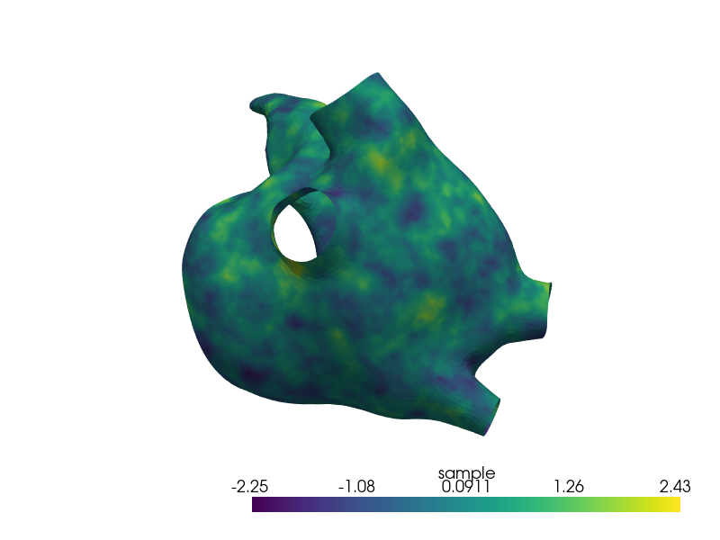

# Builder

In this tutorial, we demonstrate the high-level interface of the LS-Prior package through it's
builder component. The tutorial focuses on brevity, and showcasing the prior setup on a non-standard
mesh. For a more thorough introduction to the internals and mathematical background of `LS-Prior`,
we refer to the [components](./components.md) tutorial.

## Mesh Setup

We showcase the construction of a prior distribution on a 2D embedded surface, namely the
left-atrial manifold (the upper left chamber of the human heart). The mesh we utilize is stored
in [msh](https://gmsh.info/) format, which can easily be converted to an MPI-parallel `DOLFINx`
mesh:

```py
import dolfinx as dlx
import matplotlib.pyplot as plt
import numpy as np

mpi_communicator = MPI.COMM_WORLD
mesh, *_ = dlx.io.gmshio.read_from_msh("left_atrium_surface.msh", mpi_communicator, rank=0, gdim=3)
```

## Builder Configuration

Given our `DOLFINx` mesh, we construct a [`Prior`][ls_prior.prior.Prior] object with `LS-Prior`'s
builder component. As of now, we support building Bilaplace priors (see the [components](./components.md))
tutorial for an explanation. To configure the builder, we set up a [`BilaplacianPriorSettings`][ls_prior.builder.BilaplacianPriorSettings] data class. As mandatory settings, the configuration class requires the
mesh, a mean vector defined on the mesh's vertices, the parameters $\tau$ and $\kappa$ of the prior,
and a `DOLFINx` identifier for the FE function space we want to construct:

```py
prior_settings = builder.BilaplacianPriorSettings(
    mesh=mesh,
    mean_vector=np.zeros(mesh.geometry.x.shape[0]),
    kappa=0.5,
    tau=1,
    fe_data=("Lagrange", 2),
)
```

The prior can be configured further, see the [class documentation][ls_prior.builder.BilaplacianPriorSettings]
and [components](./components.md))
tutorial for more details.


## Prior Generation

With our configuration, we can set up a [`BilaplacianPriorBuilder`][ls_prior.builder.BilaplacianPriorBuilder]
and invoke its [`build`][ls_prior.builder.BilaplacianPriorBuilder.build] method to generate a
[`Prior`][ls_prior.prior.Prior] object:

```py
prior_builder = builder.BilaplacianPriorBuilder(prior_settings)
bilaplace_prior = prior_builder.build()
```

## Prior Functionality

Like in the [components](./components.md) tutorial, we showcase the functionality of the prior:

```py
num_vertices = mesh.geometry.x.shape[0]
test_vector_1 = np.ones(num_vertices)
test_vector_2 = 2 * np.ones(num_vertices)
test_vector_3 = 3 * np.ones(num_vertices)

cost = bilaplace_prior.evaluate_cost(test_vector_1)
grad = bilaplace_prior.evaluate_gradient(test_vector_2)
hvp = bilaplace_prior.evaluate_hessian_vector_product(test_vector_3)
sample = bilaplace_prior.generate_sample()
```

We can further visualize the sample over the atrial manifold:

```py
import pyvista as pv

vertices = mesh.geometry.x
simplices = mesh.geometry.dofmap

camera_position = [
    (92.7033800655023, -107.54971248826202, -146.9233989237418),
    (5.789453506469723, -8.405534744262697, 10.9196138381958),
    (0.64544246900107, 0.7545534378669008, -0.11854589243429736),
]
pv_mesh = pv.PolyData.from_regular_faces(vertices, simplices)
pv_mesh.point_data["sample"] = sample
plotter = pv.Plotter()
plotter.add_mesh(pv_mesh, scalars="sample", cmap="viridis", show_edges=False, show_scalar_bar=True)
plotter.show(window_size=[800, 600], cpos=camera_position)
plotter.close()
```

<figure markdown="span">
  { width="700" }
</figure>