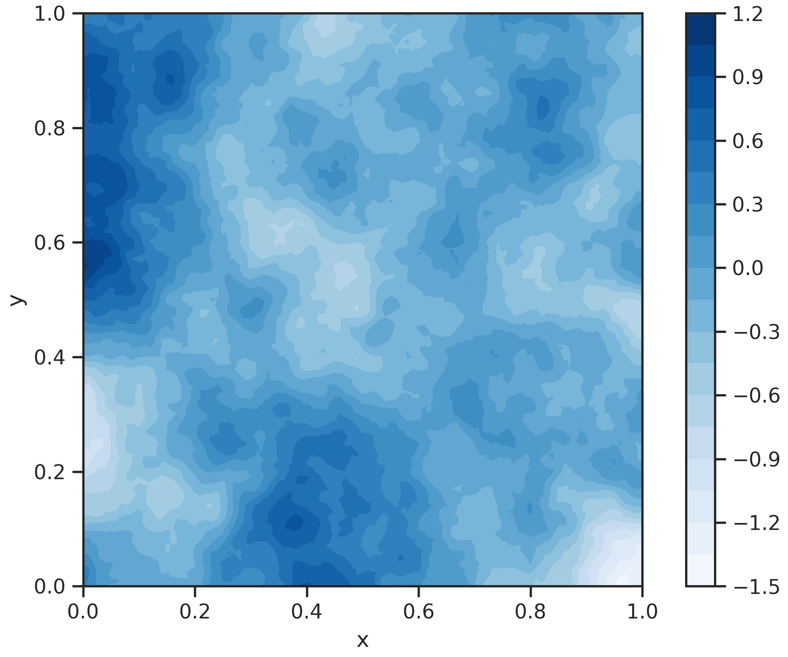

# Component Interface

The goal of this tutorial is to demonstrate the highly modular component interface of the `LS-Prior` package. This low-level interface is not the most convenient way to construct prior distributions, but it is exremely flexible with respect to future extensions. In addition, it helps understanding the underlying structure of the package, and the mathematical approach it is based on.

## Mesh Setup

`LS-Prior` helps with the generation of prior distributions for function space objects, i.e. functions defined on some domain $\Omega$, which might either be Euclidean, or an embedded manifold, with topological dimension $d$. The most important input for the construction of a prior distribution is therefore a computational mesh resembling the discretization of $\Omega$. `LS-Prior` requires input meshes in [DOLFINx](https://docs.fenicsproject.org/dolfinx/main/python/generated/dolfinx.mesh.html) format. Such meshes can easily be obtained from other common mesh formats, such as [GMSH](https://gmsh.info/).

We set up a simple square mesh with `DOLFINx` for now:

```py
import dolfinx as dlx
import numpy as np
from mpi4py import MPI

mesh = dlx.mesh.create_rectangle(
    MPI.COMM_WORLD,
    [np.array([0, 0]), np.array([1, 1])],
    [100, 100],
    dlx.mesh.CellType.triangle,
)
```

Note that we have also passed an MPI communicator to the mesh. This communicator will be utilized by all components of `LS-Prior` for MPI-parallel computations.
Furthermore, while internal computations are performed on some finite element space (to be defined), the interface of prior objects work entirely via vectors defined on the vertices of the provided mesh. This makes it easy to interface prior objects with other components in an inverse problem workflow, without relying on the specific finite element backend.

## FEM Matrix and Converter Setup

On the base level of the prior construction, we define FEM-specific data structures. Recall that we construct prior distributions whose realizations $m$ satisfy, on the domain $\Omega$, SPDEs of the form

$$
\begin{equation*}
    \tau(\kappa^2-\Delta)^{\frac{\nu}{2}}m(x) = W(x),\quad x\in\Omega
\end{equation*}
$$

where $\kappa,\tau > 0$ are parameters determining the variance and correlation properties of the realizations, $\nu > \frac{d}{2}$ determines their regularity, and W is spatial white noise on $\Omega$. In `LS-Prior`, qe can equip the SPDE either with homogneous Neumann boundary conditions,

$$
\begin{equation*}
    \nabla m(x)\cdot\mathbf{n}(x) = 0,\quad x\in\partial\Omega,
\end{equation*}
$$

or Robin boundary conditions of the form

$$
\begin{equation*}
    \nabla m(x)\cdot\mathbf{n}(x) + \beta m(x) = 0,\quad x\in\partial\Omega,
\end{equation*}
$$

where $\mathbf{n}$ is the outward unit normal vector of $\partial\Omega$, and $\beta$ is a scalar tuning coefficient for the Robin condition.

For simplicity, we assume that $\nu=2$, corresponding to the common *Bi-Laplace* prior scenario.
We can now (informally, as white noise $W$ is actually too irregular) write the SPDE in weak form against suitable test functions $\varphi$,

$$
\begin{equation*}
    \kappa^2\tau(m,\varphi)_{L^2(\Omega)} + \tau (\nabla m,\nabla\varphi)_{L^2(\Omega)} + \beta(m,\varphi)_{L^2(\partial\Omega)} = (W,\varphi)_{L^2(\Omega)}.
\end{equation*}
$$

To recover Neumann boundary conditions, we can simply set $\beta=0$. In particular, we are interested in the left-hand-side operator $\mathcal{A}$, and the "mass matrix operator" $\mathcal{M}$ corresponding to the form $(m,\varphi)_{L^2(\Omega)}$

These operators can be discretized on some finite-dimensional subspace $V_h$ in a standard finite element procedure. We do this with `DOLFINx` by first calling the [`generate_forms`][ls_prior.fem.generate_forms] method,

```py
from ls_prior import fem

kappa, tau = 10.0, 0.1
function_space = dlx.fem.functionspace(mesh, ("Lagrange", 2))
mass_matrix_form, spde_matrix_form = fem.generate_forms(function_space, kappa, tau)
```

Given a parametrization and FEM function space, this method returns [UFL](https://fenics.readthedocs.io/projects/ufl/en/latest/) forms corresponding to $\mathcal{M}$ and $\mathcal{A}$. Again using `DOLFINx`, we assemble these forms into sparse [`PETSc` matrices](https://petsc.org/release/petsc4py/reference/petsc4py.PETSc.Mat.html) $\mathbf{M}$ and $\mathbf{A}$,

```py
from dolfinx.fem import petsc

mass_matrix = petsc.assemble_matrix(dlx.fem.form(mass_matrix_form))
spde_matrix = petsc.assemble_matrix(dlx.fem.form(spde_matrix_form))
mass_matrix.assemble()
spde_matrix.assemble()
```

!!! info
    We have assembled the matrices $\mathbf
    M$ and $\mathbf
    A$ under the premise that $\nu=2$. These matrices can be used, however, as building blocks for fields of other orders $\nu$ as well.

To generate samples from a prior distribution, we will further require a factorization of $\mathbf{M}$, i.e. a matrix $\widehat{\mathbf{M}}$ such that $\widehat{\mathbf{M}}\widehat{\mathbf{M}}^T$. Such a factorization can be constructed efficinetly and in sparse form, exploiting the standard finite element assembly procedure. `LS-Prior` provides the functionality for the construction of a factorization for FEM matrices in the [`FEMMatrixFactorizationAssembler`][ls_prior.fem.FEMMatrixFactorizationAssembler] class:

```py
mass_matrix_factorization = fem.FEMMatrixFactorizationAssembler(
    mesh, function_space, mass_matrix_form
)
block_diagonal_matrix, dof_map_matrix = mass_matrix_factorization.assemble()
dof_map_matrix.transpose()
```

Given the mesh, the FE function space, and a weak form, the factorization assemble returns two sparse `PETSc` matrices $\widehat{\mathbf{M}}_e$ and $\mathbf{L}$, such that $\widehat{\mathbf{M}} = \mathbf{L}^T\widehat{\mathbf{M}}_e$. For more detailed information on these matrices, we refer to the [class documentation][ls_prior.fem.FEMMatrixFactorizationAssembler].

Lastly, we initialize a [`FEMConverter`][ls_prior.fem.FEMConverter] object,

```py
converter = fem.FEMConverter(function_space)
```

The converter will take care of the conversion between vectors defined on mesh vertices, and the internal representation on the function space DoFs.


## Basic Components

Given the underlying FEM matrices, we can start climbing up the `LS-Prior` component hierarchy. All components we will use to construct the prior adhere to [`PETScComponent`][ls_prior.components.PETScComponent] interface. This uniform interface allows for the arbitrary composition of PETSc components, resulting in new such components.

In a first step, we initialize the components that resemble the action of the matrices $\mathbf{M}$ and $\mathbf{A}$, as well as their inverses $\mathbf{M}^{-1}$ and $\mathbf{A}^{-1}$ on vectors of matching size The matrices $\mathbf{M}$, $\mathbf{A}$, $\widehat{\mathbf{M}}_e$, and $\mathbf{L}$ are used to initialize [`Matrix`][ls_prior.components.Matrix] components,

```py
mass_matrix_component = components.Matrix(mass_matrix)
spde_matrix_component = components.Matrix(spde_matrix)
block_diagonal_matrix_component = components.Matrix(block_diagonal_matrix)
dof_map_matrix_component = components.Matrix(dof_map_matrix)
```

These are just thin wrappers around the standard `PETSc` matrix interface.

We represent the action of the action of the inverse matrices $\mathbf{M}^{-1}$ and $\mathbf{A}^{-1}$ via [`InverseMatrixSolver`][ls_prior.components.InverseMatrixSolver] components. Under the hood, these components use `PETSc`'s [Krylov subspace solvers](https://petsc.org/release/petsc4py/reference/petsc4py.PETSc.KSP.html) and [preconditioners](https://petsc.org/release/petsc4py/reference/petsc4py.PETSc.PC.html) for matrix-free inversion of the provided input matrices. Next to the system matrix to invert, these components have to be initialized with an [`InverseMatrixSolverSettings`][ls_prior.components.InverseMatrixSolverSettings] data class for configuration of the solver and preconditioner.

Here we use a standard CG solver with Jacobi preconditioning for the $\mathbf{M}$-solver, and AMG preconditiong for the $\mathbf{A}$-solver,

```py
from petsc4py import PETSc

cg_solver_settings = components.InverseMatrixSolverSettings(
    solver_type=PETSc.KSP.Type.CG,
    preconditioner_type=PETSc.PC.Type.JACOBI,
    relative_tolerance=1e-6,
    absolute_tolerance=1e-8,
    max_num_iterations=10000,
)

amg_solver_settings = components.InverseMatrixSolverSettings(
    solver_type=PETSc.KSP.Type.CG,
    preconditioner_type=PETSc.PC.Type.GAMG,
    relative_tolerance=1e-6,
    absolute_tolerance=1e-8,
    max_num_iterations=10000,
)

mass_matrix_inverse_component = components.InverseMatrixSolver(cg_solver_settings, mass_matrix)
spde_matrix_inverse_component = components.InverseMatrixSolver(amg_solver_settings, spde_matrix)
```

## Composition of Components

As mentioned earlier, we can combine arbitrary [`PETScComponents`][ls_prior.components.PETScComponent] into new ones, relying on the [`PETScComponentComposition`][ls_prior.components.PETScComponentComposition] class. Objects of this type simply chain calls to all sub-components they comprise, in the order they have been provided. This means we could chain covariance operators for arbitrary, also fractional order, e.g. by using a spectral decomposition algorithm on the basic components, and wrapping it in another [`PETScComponents`][ls_prior.components.PETScComponent].

We again focus on the case $\nu=2$, i.e. the Bilaplace For the Bilaplace prior, the discrete covariance and precision matrices are given as

$$
\begin{gather*}
    \mathbf{C} = \mathbf{A}^{-1}\mathbf{M}\mathbf{A}^{-1} \\
    \mathbf{C}^{-1} = \mathbf{A}\mathbf{M}^{-1}\mathbf{A}
\end{gather*}
$$

The factorization of the covariance matrix is given accordingly,

$$
\begin{equation*}
    \widehat{\mathbf{C}} = \mathbf{A}^{-1}\widehat{\mathbf{M}} = \mathbf{A}^{-1}\mathbf{L}^T\widehat{\mathbf{M}}_e.
\end{equation*}
$$

The action of these component is conveniently wrapped as:

```py
precision_operator = components.PETScComponentComposition(
    spde_matrix_component, mass_matrix_inverse_component, spde_matrix_component
)
covariance_operator = components.PETScComponentComposition(
    spde_matrix_inverse_component, mass_matrix_component, spde_matrix_inverse_component
)
sampling_factor = components.PETScComponentComposition(
    block_diagonal_matrix_component, dof_map_matrix_component, spde_matrix_inverse_component
)
```

## Numpy Interface

In a last step, we wrap the covariance, precision, and sampling factor by [`InterfaceComponents`][ls_prior.components.InterfaceComponent]. The interface does not add any functionality, but is merely for convenience . It allows us to transition from a more indirect, reference-based `PETSc` interface to a more explicit `Numpy` interface (so we don't have to worry about overwriting stuff internally).

```py
precision_operator_interface = components.InterfaceComponent(precision_operator)
covariance_operator_interface = components.InterfaceComponent(covariance_operator)
sampling_factor_interface = components.InterfaceComponent(sampling_factor)
```

## Prior Initialization

We can now create a [`Prior`][ls_prior.prior.Prior] object from the assembled interfaces. In addition, we need to provide a mean vector $\overline{\mathbf{m}}$ in form of a vertex-based numpy array,

```py
mean_vector = np.zeros(mesh.geometry.x.shape[0], dtype=np.float64)
```

our [`FEMConverter`][ls_prior.fem.FEMConverter] object, and a seed for the prior's internal RNG. In total, the prior initialization is as simply as

```py
bilaplace_prior = prior.Prior(
    mean_vector,
    precision_operator_interface,
    covariance_operator_interface,
    sampling_factor_interface,
    converter,
    seed=0,
)
```


## Prior Functionality

To conclude this tutorial, let us briefly test the functionality provided by [`Prior`][ls_prior.prior.Prior] objects.

As of now, the interface provides the following methods:

1. [`evaluate_cost`][ls_prior.prior.Prior.evaluate_cost]: Compute the negative "log-probability" (this term is a misnomer in the function space setting) for a given state $\mathbf{m}$, corresponding to a cost in the optimization context, i.e. $\frac{1}{2}(\mathbf{m}-\overline{\mathbf{m}})^T\mathbf{C}^{-1}(\mathbf{m}-\overline{\mathbf{m}})$.

2. [`evaluate_gradient`][ls_prior.prior.Prior.evaluate_gradient]: Compute the derivative of the cost with respect to the state $\mathbf{m}$, i.e. $\mathbf{C}^{-1}(\mathbf{m}-\overline{\mathbf{m}})$.

3. [`evaluate_hessian_vector_product`][ls_prior.prior.Prior.evaluate_hessian_vector_product]: Evaluate the Hessian vector product in a direction $\widehat{\mathbf{m}}$, i.e. $\mathbf{C}^{-1}\widehat{\mathbf{m}}$.

4. [`generate_sample`][ls_prior.prior.Prior.generate_sample]: Generate a sample $\widetilde{\mathbf{m}}$ from the prior  distribution.

```py
rng = np.random.default_rng(0)

test_vector_1 = rng.random(mean_vector.shape)
test_vector_2 = 2 * rng.random(mean_vector.shape)
test_vector_3 = 3 * rng.random(mean_vector.shape)

cost = bilaplace_prior.evaluate_cost(test_vector_1)
grad = bilaplace_prior.evaluate_gradient(test_vector_2)
hvp = bilaplace_prior.evaluate_hessian_vector_product(test_vector_3)
sample = bilaplace_prior.generate_sample()
```

Let us also plot the sample:

```py
import matplotlib.pyplot as plt

vertices = mesh.geometry.x
simplices = mesh.geometry.dofmap

fig, ax = plt.subplots(figsize=(6, 5), layout="constrained")
contour_plot = ax.tricontourf(vertices[:, 0], vertices[:, 1], sample, levels=20, cmap="Blues")
plt.colorbar(contour_plot)
```

<figure markdown="span">
  { width="700" }
</figure>